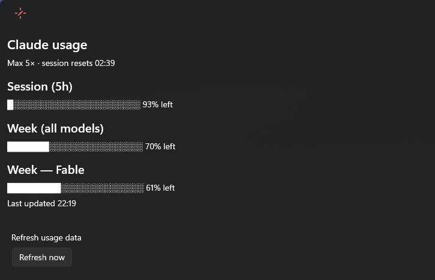

# ClaudeUsage

**See how much Claude Code you have left — right in your Windows dock.**

A PowerToys Command Palette extension that pins your Claude subscription limits to the CmdPal dock as a live **"Claude 93%"** band. Click it for the full picture:

## Features

- **⚡ Dock band**: live indicator of your 5-hour session (% left), with weekly % and reset time in the subtitle
- **📊 Stats page**: session, weekly, and per-model limits as progress bars, with reset countdowns and a one-click refresh
- **🎨 Smart color alerts**: the icon fills orange when less than 20% of your session remains
- **🔒 Zero telemetry**: talks only to Anthropic's official usage API with the token Claude Code already stores locally; no telemetry, nothing else leaves your machine

## Requirements

- Windows 11 (22H2 or later)
- PowerToys Command Palette (v0.9+)
- Claude Code signed in with valid OAuth token

## Installation

1. Clone/download this repo
2. Run `build-and-install.ps1` from a normal PowerShell prompt
3. On first install, UAC prompts once to trust the dev certificate; updates install without elevation
4. Open Command Palette (Win+Alt+Space)
5. Enable "Claude usage" in Dock settings to see the live band

## How it Works

The extension reads your Claude Code OAuth token from `%USERPROFILE%\.claude\.credentials.json` and fetches live usage data from `https://api.anthropic.com/api/oauth/usage` every 5 minutes. No token is logged or displayed.

## Troubleshooting

The dock band reports its state instead of numbers when something is wrong:

| Band subtitle | Meaning |
|---|---|
| `sign in to Claude Code` | `%USERPROFILE%\.claude\.credentials.json` not found — sign in to Claude Code |
| `API error {status}` | Anthropic's usage endpoint returned an error |
| `offline` | Network unreachable or request timed out |
| `parse error` | Response could not be parsed |

For a full trace, create an empty file `%TEMP%\claudeusage-debug.on` and check `%TEMP%\claudeusage-debug.log` — it records the request/response flow but never the token. Delete the flag file to stop logging.

## Development

- Edit source files in `ClaudeUsage/` (C# 12, .NET 9.0-windows)
- Bump the version in `Package.appxmanifest`, then run `build-and-install.ps1`
- Check PowerShell output for build errors

## License

MIT — see [LICENSE](LICENSE).
